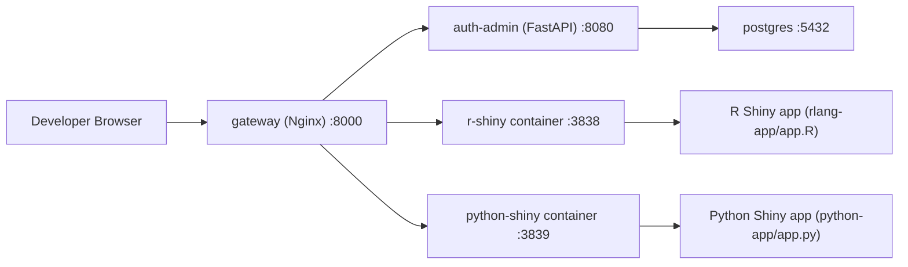
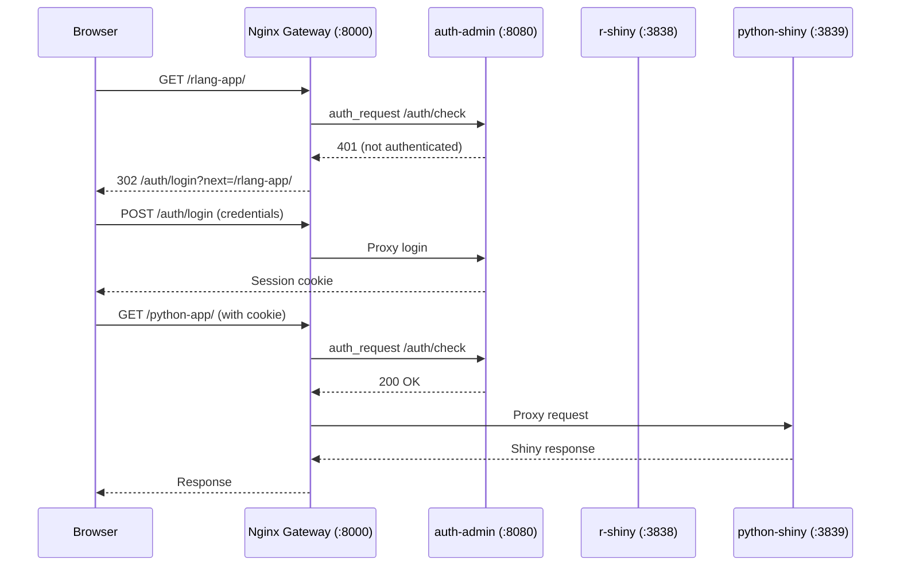
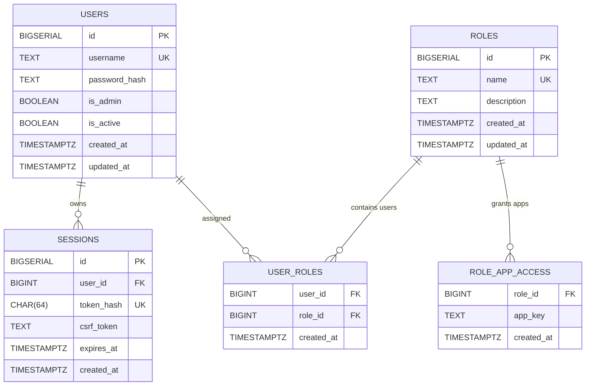

# Shiny Web Container Template

[](https://doi.org/10.5281/zenodo.18878092)
[](https://github.com/Bio2Byte/shiny-web-container/actions/workflows/jekyll-gh-pages.yml)
[](https://bio2byte.github.io/shiny-web-container/)
[](https://github.com/Bio2Byte/shiny-web-container/blob/main/LICENSE)
[](https://github.com/Bio2Byte/shiny-web-container/releases)

<div align="center">
  
</div>

Production-style boilerplate for running two sample Shiny applications behind a single gateway on port `8000`:

- R Shiny app at `/rlang-app`
- Python Shiny app at `/python-app`
- Auth UI at `/auth/login`
- User admin UI at `/admin/users`

This repository is designed as a template/exhibition project for building containerized Shiny systems.

## Current MVP

- Multi-container runtime with `docker compose`
- Reverse proxy routing with Nginx
- R Shiny sample app with:
  - table
  - Plotly scatter plot
- Python Shiny sample app with:
  - table
  - Plotly scatter plot
- Runtime hardening:
  - app-level health checks
  - gateway waits for healthy backends
  - graceful stop periods and init process per container
- Authentication:
  - NGINX `auth_request` gate in front of both Shiny apps
  - FastAPI auth service for login/session validation
  - PostgreSQL for users and sessions
  - RBAC roles with app-scoped access policies
  - Admin UIs for user and role management

## Technical Stack (Developer Reference)

| Layer | Technology | Why It Is Used |
|---|---|---|
| Container orchestration | Docker Compose | Runs and connects multiple containers as one local stack |
| Gateway / routing | Nginx (`nginx:1.27-alpine`) | Single public entrypoint on `:8000`, path-based routing to multiple apps |
| R web app | Shiny for R + Plotly | Interactive R dashboard sample with table + scatter plot |
| Python web app | Shiny for Python + Plotly + Pandas | Interactive Python dashboard sample with table + scatter plot |
| Auth and admin | FastAPI + Jinja templates | Login/logout, session checks, role CRUD, and user-role assignments |
| Persistence | PostgreSQL 16 | Stores users and active sessions |
| Base runtime images | `rocker/r-ver:4.4.1`, `python:3.12-slim` | Stable language runtimes for reproducible local/dev containers |

## Container Topology (Mermaid)



## Nginx Routing Role (Mermaid)



## Quick Start

### Prerequisites

- Docker Engine 24+
- Docker Compose v2+

### Run

```bash
cp .env.example .env
docker compose build auth-admin
docker compose up -d --no-build
```

For a full clean build on a new machine:

```bash
cp .env.example .env
docker compose up --build
```

### Open

- <http://localhost:8000/auth/login>
- <http://localhost:8000/auth/logout>
- <http://localhost:8000/auth/forbidden>
- <http://localhost:8000/admin/users>
- <http://localhost:8000/admin/roles>
- <http://localhost:8000/rlang-app>
- <http://localhost:8000/python-app>

### Bootstrap Admin Credentials

- Username: value of `APP_ADMIN_USERNAME` from `.env`
- Password: value of `APP_ADMIN_PASSWORD` from `.env`

The auth service enforces this bootstrap admin user on startup by upserting it in PostgreSQL.

## Authentication Layer Usage

### Access Flow

1. Open a protected route such as `/rlang-app/` or `/python-app/`.
2. NGINX calls internal `/_auth_check` (`auth_request`) against the auth service.
3. If no valid session cookie exists, you are redirected to `/auth/login?next=<original-path>`.
4. Submit credentials on `/auth/login`.
5. On success, the auth service sets the session cookie and redirects back to `next`.
6. For protected apps, `/auth/check` enforces role-based access:
7. `admin` users are always allowed.
8. non-admin users require a role granting that app (`rlang_app` or `python_app`).
9. missing permission returns `403` and lands on `/auth/forbidden`.

### Admin Operations

Use `/admin/users` and `/admin/roles` (admin-only) to:

- create users
- set/reset user passwords
- activate/deactivate users
- delete users (except your own account)
- create/edit/delete roles
- bind each role to one or more Shiny apps
- assign/remove roles for users

### Logout

- Regular users can open `/auth/logout` to access a dedicated logout page.
- Session termination is executed via CSRF-protected `POST /auth/logout`.
- Active session row is removed from PostgreSQL and the browser cookie is cleared.

### Environment Variables (Auth)

- `POSTGRES_DB`, `POSTGRES_USER`, `POSTGRES_PASSWORD`: database credentials
- `APP_ADMIN_USERNAME`, `APP_ADMIN_PASSWORD`: bootstrap admin identity
- `APP_SESSION_COOKIE_NAME`: session cookie key
- `APP_SESSION_TTL_HOURS`: session lifetime
- `APP_COOKIE_SECURE`: set `true` when running behind HTTPS
- `APP_MIN_PASSWORD_LENGTH`: server-side password policy floor

## Authentication ER Diagram (Mermaid)



## Project Layout

```text
.
├── docker-compose.yml
├── .env.example
├── docker
│   ├── auth-admin/Dockerfile
│   ├── nginx/nginx.conf
│   ├── python-shiny/Dockerfile
│   └── r-shiny/Dockerfile
├── auth-admin
│   ├── app/main.py
│   └── app/templates/*.html
├── docs
│   ├── _config.yml
│   ├── index.md
│   ├── quickstart.md
│   ├── architecture.md
│   ├── authentication.md
│   ├── security.md
│   └── contributing.md
├── python-app/app.py
└── rlang-app/app.R
```

## GitHub Pages

Project documentation pages are under `docs/` and are intended for GitHub Pages publishing.

### Local Preview (Before Commit)

Run GitHub Pages-compatible local preview with Jekyll:

```bash
docker compose --profile docs up -d --build docs-preview
```

Open:

- <http://localhost:4000>

Stop preview:

```bash
docker compose --profile docs stop docs-preview
docker compose --profile docs rm -f docs-preview
```

## Security Notes

- Passwords are stored with bcrypt hashes, never plaintext.
- Session cookies are HttpOnly + SameSite and validated on every protected request.
- CSRF tokens are enforced for all state-changing admin/logout forms.
- No secrets are hardcoded in tracked files.
- Containers expose only gateway port `8000` to the host.

## Metadata

- Citation: `CITATION.cff`
- License: `LICENSE`
- Contribution guide: `CONTRIBUTING.md`
- Code of Conduct: `CODE_OF_CONDUCT.md`
- Security policy: `SECURITY.md`
- Changelog: `CHANGELOG.md`

## Developed By

Developed by Bio2Byte in Belgium: "We research the relation between protein sequence and biophysical behavior."

Reach us out:

- Official website: [bio2byte.be](https://bio2byte.be)
- Official GitHub organisation: [github.com/bio2byte](https://github.com/bio2byte)
- LinkedIn page: [Bio2Byte](https://www.linkedin.com/company/bio2byte/)
- Email: [bio2byte@vub.be](mailto:bio2byte@vub.be)
