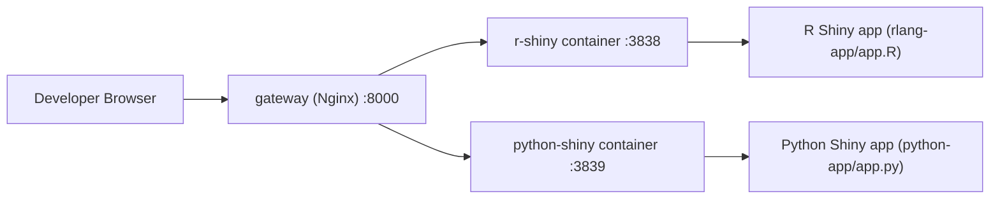
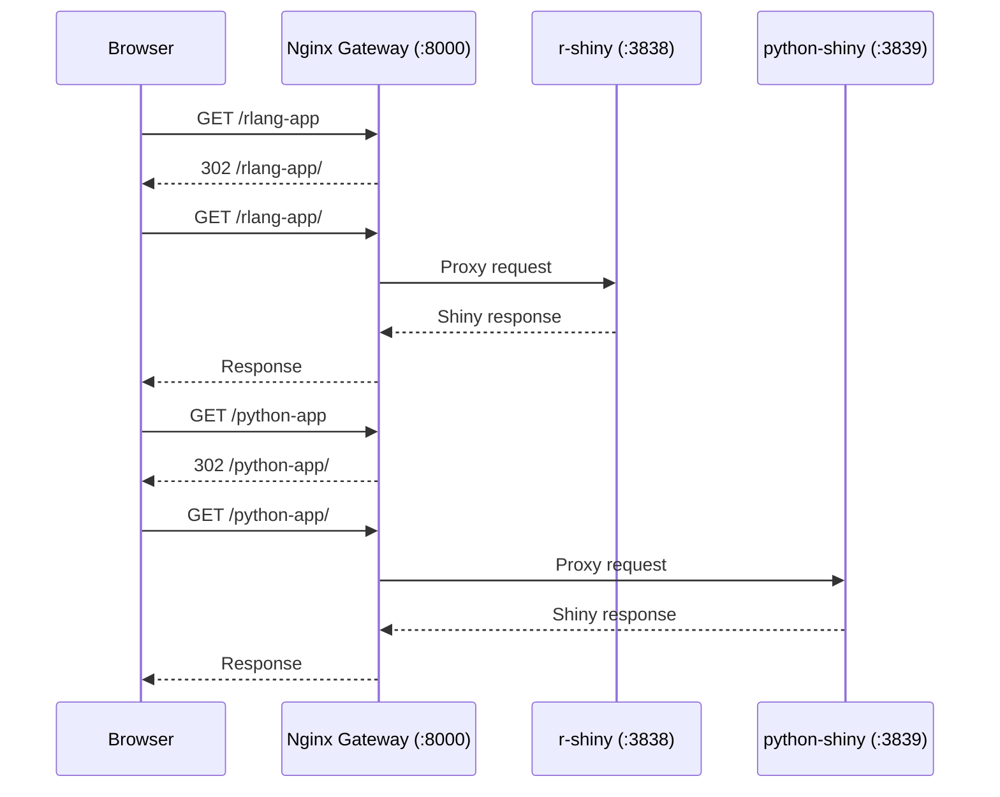

# Shiny Web Container Template

Production-style boilerplate for running two sample Shiny applications behind a single gateway on port `8000`:

- R Shiny app at `/rlang-app`
- Python Shiny app at `/python-app`

This repository is designed as a template/exhibition project for building containerized Shiny systems.

## Current MVP

- Multi-container runtime with `docker compose`
- Reverse proxy routing with Nginx
- R Shiny sample app with:
  - table
  - Plotly scatter plot
- Python Shiny sample app with:
  - table
  - Plotly scatter plot

## Technical Stack (Developer Reference)

| Layer | Technology | Why It Is Used |
|---|---|---|
| Container orchestration | Docker Compose | Runs and connects multiple containers as one local stack |
| Gateway / routing | Nginx (`nginx:1.27-alpine`) | Single public entrypoint on `:8000`, path-based routing to multiple apps |
| R web app | Shiny for R + Plotly | Interactive R dashboard sample with table + scatter plot |
| Python web app | Shiny for Python + Plotly + Pandas | Interactive Python dashboard sample with table + scatter plot |
| Base runtime images | `rocker/r-ver:4.4.1`, `python:3.12-slim` | Stable language runtimes for reproducible local/dev containers |

## Container Topology (Mermaid)



## Nginx Routing Role (Mermaid)



## Quick Start

### Prerequisites

- Docker Engine 24+
- Docker Compose v2+

### Run

```bash
docker compose up --build
```

### Open

- <http://localhost:8000/rlang-app>
- <http://localhost:8000/python-app>

## Project Layout

```text
.
├── docker-compose.yml
├── docker
│   ├── nginx/nginx.conf
│   ├── python-shiny/Dockerfile
│   └── r-shiny/Dockerfile
├── python-app/app.py
└── rlang-app/app.R
```

## Security Notes

- No authentication is implemented yet in this step.
- No secrets are hardcoded.
- Containers expose only gateway port `8000` to the host.

The next planned step introduces simple user/password authentication backed by PostgreSQL.

## Metadata

- Citation: `CITATION.cff`
- License: `LICENSE`
- Contribution guide: `CONTRIBUTING.md`
- Code of Conduct: `CODE_OF_CONDUCT.md`
- Security policy: `SECURITY.md`
- Changelog: `CHANGELOG.md`
