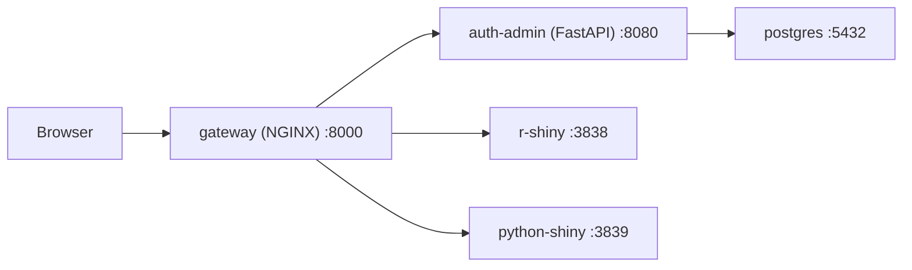

# Architecture

## Stack Layers

| Layer | Technology | Role |
|---|---|---|
| Gateway | NGINX | Single public entrypoint (`:8000`), routing + auth checks |
| Auth/Admin | FastAPI + Jinja | Login/logout, session checks, user CRUD |
| RBAC | Roles + role-app mappings | Restricts specific Shiny apps to authorized user groups |
| Persistence | PostgreSQL 16 | Users, roles, role grants, and sessions |
| App 1 | R Shiny + Plotly | Sample analytics app at `/rlang-app` |
| App 2 | Python Shiny + Plotly/Pandas | Sample analytics app at `/python-app` |
| Orchestration | Docker Compose | Service lifecycle and network |

## Container Topology

## Routing Model

- `/auth/*` and `/admin/*` -> `auth-admin`
- `/rlang-app/*` -> `r-shiny` (after successful auth check)
- `/python-app/*` -> `python-shiny` (after successful auth check)

## Health and Startup Model

- Each app service has a healthcheck.
- `gateway` waits for healthy dependencies before startup.
- `init: true` and graceful stop periods are configured for cleaner process lifecycle.
