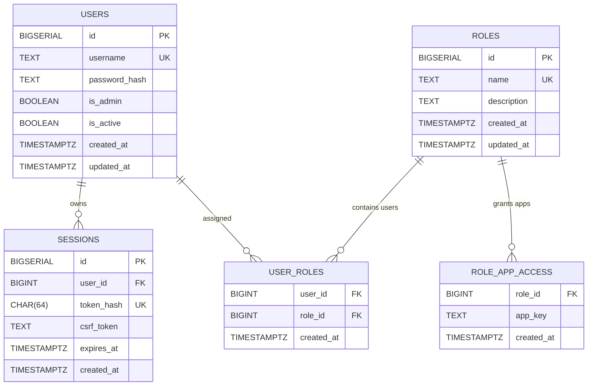

# Authentication

## High-Level Flow

1. User requests `/rlang-app/` or `/python-app/`.
2. NGINX issues internal auth subrequest to `/_auth_check`.
3. `/_auth_check` proxies to `auth-admin:/auth/check`.
4. If `401`, user is redirected to `/auth/login?next=<original-path>`.
5. If `403`, user is sent to `/auth/forbidden` (authenticated but missing role permission).
6. If `200`, request is proxied to target Shiny app.

## User-Facing Endpoints

- `GET /auth/login` - login form
- `POST /auth/login` - credential verification + session creation
- `GET /auth/logout` - logout confirmation page
- `POST /auth/logout` - CSRF-validated logout, session delete, cookie clear
- `GET /admin/users` - admin-only user management UI
- `GET /admin/roles` - admin-only role and app-access management UI

## Session Model

- Passwords stored as bcrypt hashes.
- Browser receives opaque session token cookie.
- Server stores SHA-256 hash of token (`sessions.token_hash`), not raw token.
- Session is valid only if:
  - user is active
  - session exists
  - session is unexpired
- App access is valid only if:
  - user is admin, or
  - user has at least one role mapped to the requested app key

## Role Model

- App keys:
  - `rlang_app` -> `/rlang-app`
  - `python_app` -> `/python-app`
- A non-admin user can open an app only when one of their roles grants that app key.
- Admin users have global access without role checks.

## CSRF Controls

- State-changing requests require a CSRF token.
- Covered operations:
  - logout
  - admin create/update/delete/toggle actions

## Auth Schema (ER)

