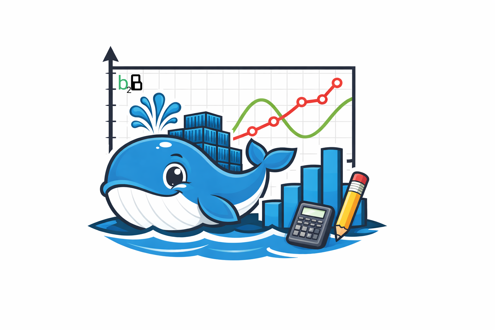
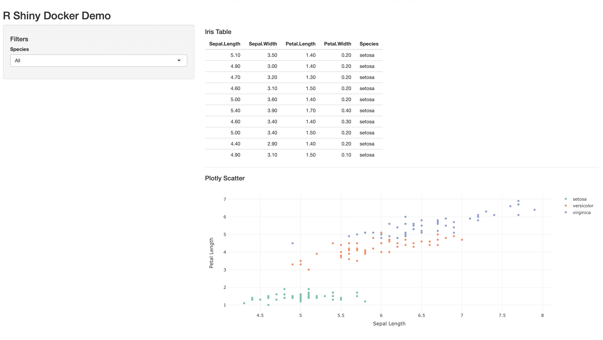
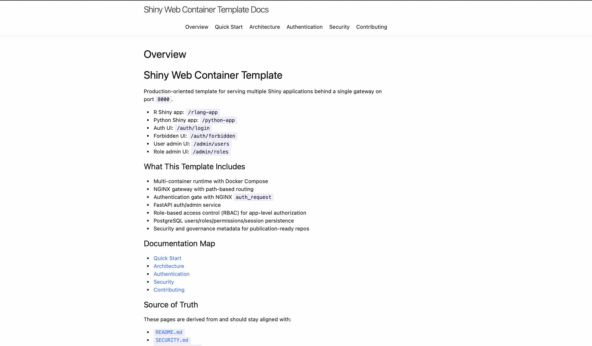

# Shiny Web Container Template

Production-oriented template for serving multiple Shiny applications behind a single gateway on port `8000`.

- R Shiny app: `/rlang-app`
- Python Shiny app: `/python-app`
- Auth UI: `/auth/login`
- Forbidden UI: `/auth/forbidden`
- User admin UI: `/admin/users`
- Role admin UI: `/admin/roles`

## What This Template Includes

- Multi-container runtime with Docker Compose
- NGINX gateway with path-based routing
- Authentication gate with NGINX `auth_request`
- FastAPI auth/admin service
- Role-based access control (RBAC) for app-level authorization
- PostgreSQL users/roles/permissions/session persistence
- Security and governance metadata for publication-ready repos

## Documentation Map

- [Quick Start](./quickstart)
- [Architecture](./architecture)
- [Authentication](./authentication)
- [Security](./security)
- [Contributing](./contributing)

## Visual Overview

### Platform Entry

### User Administration Console

### Role Administration Console

### Authorization Denied State

### Local Docs Preview

## Source of Truth

These pages are derived from and should stay aligned with:

- [`README.md`]({{ site.github.repository_url }}/blob/main/README.md)
- [`SECURITY.md`]({{ site.github.repository_url }}/blob/main/SECURITY.md)
- [`CONTRIBUTING.md`]({{ site.github.repository_url }}/blob/main/CONTRIBUTING.md)
- [`CHANGELOG.md`]({{ site.github.repository_url }}/blob/main/CHANGELOG.md)
- [`LICENSE`]({{ site.github.repository_url }}/blob/main/LICENSE)
- [`CITATION.cff`]({{ site.github.repository_url }}/blob/main/CITATION.cff)

## Developed By

Developed by Bio2Byte in Belgium: "We research the relation between protein sequence and biophysical behavior."

Reach us out:

- Official website: [bio2byte.be](https://bio2byte.be)
- Official GitHub organisation: [github.com/bio2byte](https://github.com/bio2byte)
- LinkedIn page: [Bio2Byte](https://www.linkedin.com/company/bio2byte/)
- Email: [bio2byte@vub.be](mailto:bio2byte@vub.be)
