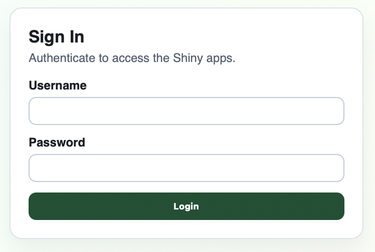
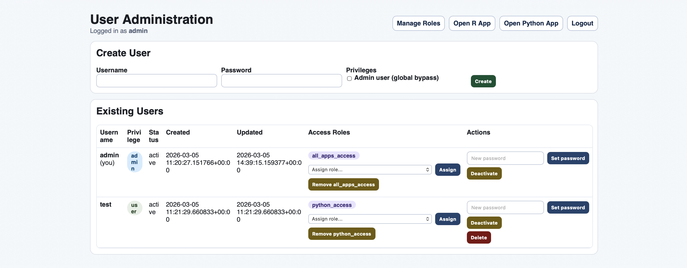
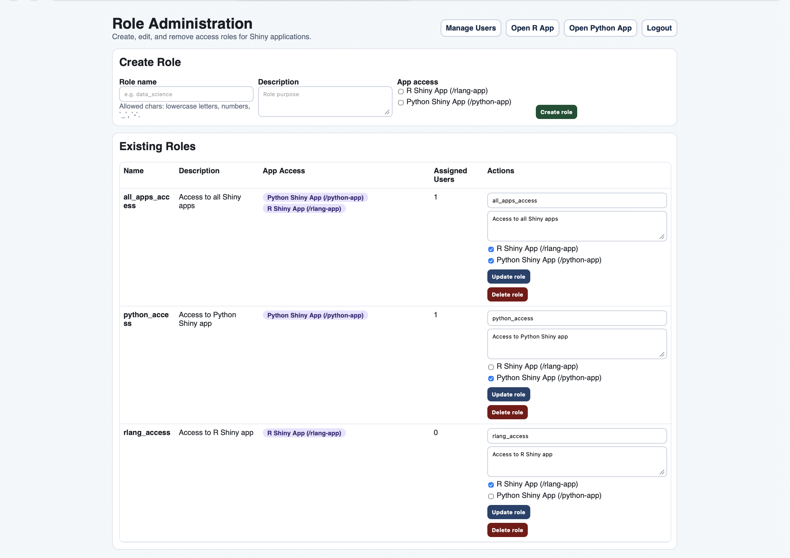
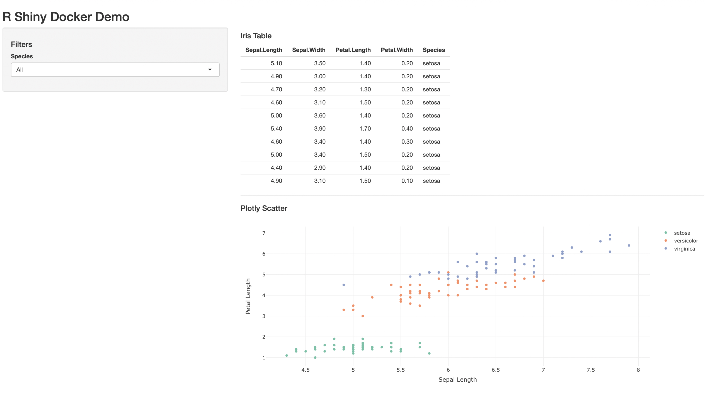
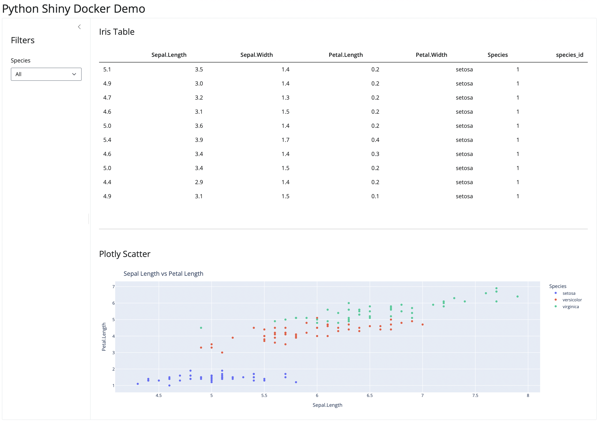
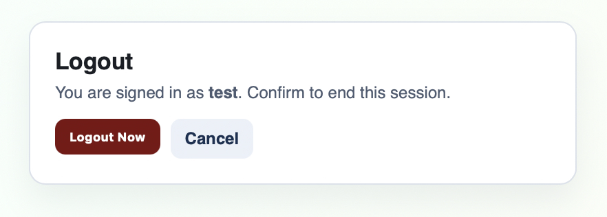
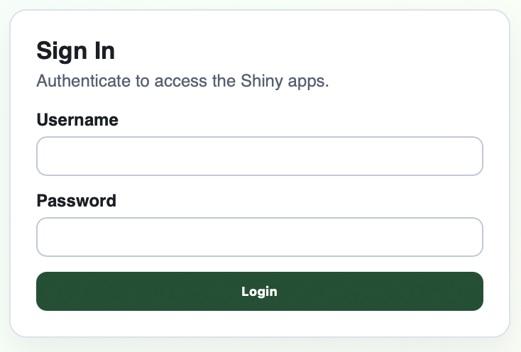

# Quick Start

## Prerequisites

- Docker Engine 24+
- Docker Compose v2+

## Run (Fast Local Path)

```bash
cp .env.example .env
docker compose build auth-admin
docker compose up -d --no-build
```

## Run (Full Build)

```bash
cp .env.example .env
docker compose up --build
```

## Open in Browser

- `http://localhost:8000/auth/login`
- `http://localhost:8000/auth/logout`
- `http://localhost:8000/auth/forbidden`
- `http://localhost:8000/admin/users`
- `http://localhost:8000/admin/roles`
- `http://localhost:8000/rlang-app`
- `http://localhost:8000/python-app`

## Bootstrap Admin Credentials

Defined in `.env`:

- `APP_ADMIN_USERNAME`
- `APP_ADMIN_PASSWORD`

The auth service enforces this admin at startup (upsert in PostgreSQL).

## Operational Notes

- Only `gateway` exposes host port `8000`.
- Application services are internal-only.
- Protected app routes require authentication before proxy pass.
- Non-admin users need at least one role granting app access.
- Admin users bypass role checks for app routes.

## Visual Checkpoints

### Login Screen



### User Management



### Role Management



### Authorized App Access





### Logout and Post-Logout Redirect




