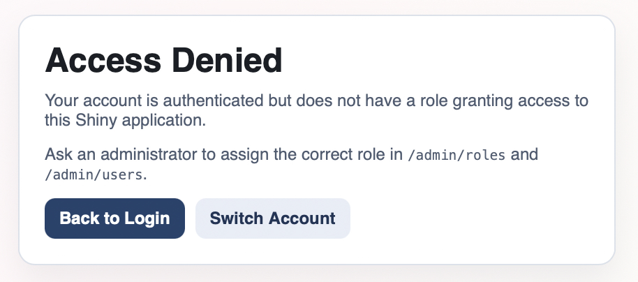

# Security

This page summarizes the implemented security model. Full policy and detailed notes are maintained in [`SECURITY.md`]({{ site.github.repository_url }}/blob/main/SECURITY.md).

## Baseline Controls

- No hardcoded secrets in tracked source files
- Gateway-only host exposure on port `8000`
- Auth gate before protected Shiny routes
- Session-based access control
- Role-based app authorization
- CSRF validation for state-changing operations
- Password hashing with bcrypt

## NGINX Controls

- `/_auth_check` is `internal`
- auth subrequests forward cookies to auth service
- public `/auth/check` is blocked (`404`)
- `401` on auth check redirects to login preserving `next` target
- `403` on auth check routes to forbidden page

## Auth-App Controls

- Parameterized SQL (`psycopg`) for DB interactions
- Bootstrap admin managed from environment variables
- Role tables (`roles`, `user_roles`, `role_app_access`) control per-app authorization
- Last-active-admin protection on destructive admin operations
- Session invalidation on user deactivation

## Security-Relevant UI States

### Access Denied (Authorization Failure)

### Role Policy Administration

## Production Expectations

- Use HTTPS and set `APP_COOKIE_SECURE=true`
- Manage credentials through deployment environment or secret manager
- Restrict operational access to database and internal service network
